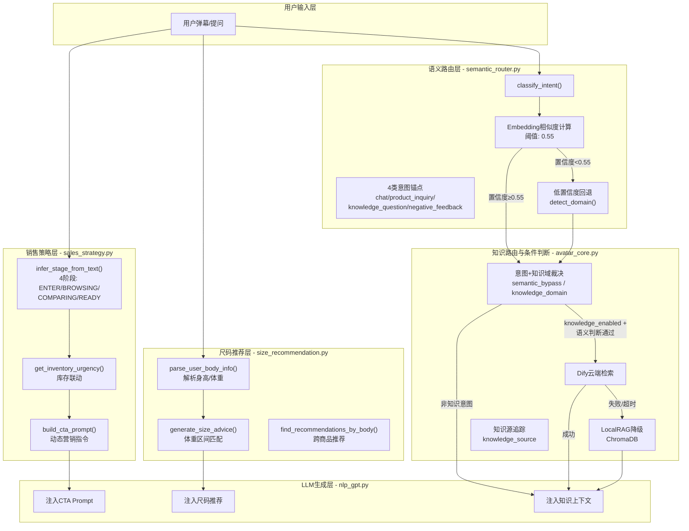

<markdown_report>

## 1. 高层摘要 (TL;DR)
2026.5.3

**影响范围**: 🔴 **高** - 涉及核心对话链路、知识检索、销售策略三大方向

**关键变更**:
- ✨ 新增**语义路由器** (`semantic_router.py`),用 Embedding 相似度替代关键词正则匹配,提升意图识别准确率
- 🎯 新增**销售状态机** (`sales_strategy.py`),根据用户对话阶段动态生成营销指令,实现主动促单
- 📏 新增**尺码推荐引擎** (`size_recommendation.py`),支持基于用户身材的智能尺码推荐
- 🔄 实现**端云协同知识管道**,Dify 失败时自动降级到本地 ChromaDB
- 📝 扩展商品管理功能,新增尺码表、颜色、版型、面料等字段录入
- 🛠️ 修复 **5 个 P0/P1 线上问题**（qa.csv 误匹配、语义路由废弃、违禁词误杀、口语漏检、响应慢）
- 🔧 优化**链路逻辑**（阈值收紧、body 推荐顺序调整、Dify 降级守卫）
- 🎨 修复**前端 5 类运行时错误**（onPress/classNames/null guards）

---

## 2. 可视化概览 (代码与逻辑映射)



---

## 3. 详细变更分析

### 📦 组件一:语义路由器 (Semantic Router)

**新增文件**: `backend/services/semantic_router.py`

**核心设计**:
- 使用 **BGE-M3 Embedding** 模型计算意图相似度,替代纯关键词正则匹配
- 定义 **4 类意图锚点**:
  - `chat`: 闲聊 ("你好", "你是谁", "谢谢")
  - `product_inquiry`: 商品咨询 ("多少钱", "有M码吗", "怎么买")
  - `knowledge_question`: 知识问答 ("面料是什么", "怎么洗", "会缩水吗")
  - `negative_feedback`: 负面反馈 ("太贵了吧", "不好看", "骗人的")
- **相似度阈值**: 0.55,低于阈值回退到关键词匹配
- **单例模式**: 延迟初始化,避免重复加载模型

**解决的核心问题**:
| 问题场景 | 旧方案 (关键词) | 新方案 (语义路由) |
|---------|----------------|------------------|
| "这件衣服一点都不透气吧?" | ❌ 匹配到 "透气" → fabric 域 | ✅ 识别为 negative_feedback |
| "这个料子怎么样" | ❌ "料子" 不匹配 "面料" → 漏检 | ✅ 识别为 knowledge_question |
| "洗完会缩水吗" | ✅ 匹配 "缩水" → care 域 | ✅ 识别为 knowledge_question |

**集成点**:
- `core/avatar_core.py L474`: 替换 `detect_knowledge_domain()` 为语义路由优先逻辑
- `backend/services/knowledge_service.py L91`: 标注 `detect_domain()` 为 Legacy

---

### 🎯 组件二:销售状态机 (Sales Strategy)

**新增文件**: `backend/services/sales_strategy.py`

**核心功能**:

#### 2.1 销售阶段推断 (`infer_stage_from_text()`)

```python
class SalesStage(Enum):
    ENTER = "enter"        # 刚进直播间
    BROWSING = "browsing"  # 浏览商品
    COMPARING = "comparing"  # 对比犹豫
    READY = "ready"       # 准备下单
```

**推断规则**:
- **READY**: 出现购买意向词 ("怎么买", "下单", "多少钱", "有优惠吗")
- **COMPARING**: 出现对比词 ("哪个好", "有什么区别", "和...比")
- **ENTER**: 首次进入商品或发起泛咨询 ("推荐", "有什么", "看看新款")
- **BROWSING**: 询问面料、材质、尺码、颜色、适合等细节

> **检测优先级**: READY > COMPARING > ENTER > BROWSING（默认兜底为 ENTER，避免空状态误判）

**代码变更**:
- 新增 `enter_signals`（"推荐", "有什么", "看看", "新款", "上新", "介绍一下"）,在该信号命中时推断为 ENTER
- 默认回退从 BROWSING 改为 ENTER,更准确反映「未表达具体需求」的状态

#### 2.2 库存联动 (`get_inventory_urgency()`)

| 库存数量 | 营销话术 | 紧急级别 |
|---------|---------|---------|
| ≤ 0 | "这款目前已售罄,要不要看看相似款?" | 3 |
| ≤ 3 | "这款库存仅剩最后{X}件!错过就没了,现在拍下立马发货!" | 3 |
| ≤ 10 | "这款是爆款,库存只剩{X}件了,喜欢的话抓紧哦~" | 2 |
| > 10 | "库存充足,可以放心选购~" | 0 |

#### 2.3 动态 CTA 生成 (`build_cta_prompt()`)

根据销售阶段和库存状态生成营销指令,注入 System Prompt:

```python
# 示例:READY阶段 + 库存紧张
"你是一名专业又亲切的服装导购。回答用户问题时,请自然结合以下营销策略,不要生硬拼接:
【商品】法式碎花连衣裙。突出现在下单的好处与时效,强调穿着价值和服务保障,促成当下决策。
这款库存仅剩最后3件!错过就没了,现在拍下立马发货! 今天下单包邮哦~"
```

**集成点**:
- `core/avatar_core.py L563-566`: 传递 `sales_stage` 到 `chat_context`
- `llm/nlp_gpt.py L207-216`: 注入 CTA Prompt 到 System Prompt

---

### 📏 组件三:尺码推荐引擎 (Size Recommendation)

**新增文件**: `backend/services/size_recommendation.py`

**核心功能**:

#### 3.1 用户身材解析 (`parse_user_body_info()`)

```python
# 支持多种格式
"我160cm,120斤" → {"height": 160, "weight": 120}
"100斤" → {"weight": 100}
"身高165,体重55kg" → {"height": 165, "weight": 110}  # kg自动转斤
```

#### 3.2 尺码匹配规则 (`generate_size_advice()`)

| 规则名称 | 条件 | 动作 |
|---------|------|------|
| 体重区间匹配 | 用户体重在 `建议体重` 范围内 | 推荐对应尺码 |
| 修身款建议 | `fit == "修身"` | "如需活动余量可考虑大一码" |
| 宽松款建议 | `fit == "宽松"` | "按推荐尺码选购即可" |
| 弹力面料 | 面料含 "弹" | "面料含弹性纤维,对身材包容度较高" |

#### 3.3 跨商品推荐 (`find_recommendations_by_body()`)

根据用户身材推荐全库合适商品:
- **梨形身材**: 优先推荐宽松/oversized 版型
- **肩宽用户**: 优先推荐有尺码表的商品
- **小个子**: 优先推荐衣长 ≤ 70cm 的商品

**集成点**:
- `core/avatar_core.py L493-499`: 在产品匹配后注入尺码推荐
- `backend/services/product_intro_service.py L732-745`: 修复 `size_chart` (dict 类型) 格式化逻辑

---

### 🔄 组件四:端云协同知识管道

**修改文件**: `core/avatar_core.py`

**核心逻辑**:

```python
# 优先 Dify 云端检索
knowledge_result = retrieve_knowledge_context_details(original_msg, domain=knowledge_domain)
knowledge_context = knowledge_result.get("context")

# Dify 失败时自动降级到本地 ChromaDB
if not knowledge_context:
    try:
        from backend.services.local_rag_api_service import query_local_rag, _has_api_key
        if _has_api_key():
            local_result = query_local_rag(original_msg, domain=knowledge_domain)
            local_context = (local_result or {}).get("context") or ""
            if local_context:
                knowledge_context = local_context
                knowledge_reason = "local_rag_fallback"
    except Exception:
        pass  # 静默降级,不影响主流程
```

**追踪字段**:
- `knowledge_source`: `"dify"` 或 `"local_rag"`
- `knowledge_reason`: `"context_loaded"`, `"local_rag_fallback"`, `"context_unavailable"`

**性能目标**: Dify 不可用时,300ms 内切换本地引擎

---

### 📝 组件五:商品管理功能扩展

#### 5.1 数据模型扩展

**文件**: `frontend/lib/types/product.ts`

```typescript
// 新增尺码表行结构
export interface SizeChartRow {
  尺码: string
  胸围: number | ""
  腰围: number | ""
  臀围: number | ""
  肩宽: number | ""
  袖长: number | ""
  衣长: number | ""
  建议体重: string
}

// 扩展商品类型
export interface Product {
  // ... 原有字段 ...
  sizes?: string[]              // ["S", "M", "L", "XL"]
  size_chart?: Record<string, SizeChartRow>
  colors?: string[]             // ["白色", "黑色"]
  fit?: string                  // "修身", "宽松", "oversized"
  fabric?: string               // "100%棉", "雪纺"
}
```

#### 5.2 后端接口扩展

**文件**: `gui/aigc_server.py`

**新增接口**: `POST /api/products/generate-description`

```python
# 功能: 根据商品结构化信息生成电商描述
prompt = (
    f"请根据以下商品信息生成一段100-200字的电商商品描述,突出商品特点、属性和卖点和适合人群,语气自然亲切。\n"
    f"商品名称:{name}\n"
    f"商品类别:{category}\n"
    f"商品特点:{features or '暂无'}\n"
    "请直接输出描述文本,不要加标题或前缀。"
)
```

**修改接口**: `POST /api/products/save`

```python
product_info = {
    # ... 原有字段 ...
    "sizes": data.get("sizes", []),
    "size_chart": data.get("size_chart", {}),
    "colors": data.get("colors", []),
    "fit": data.get("fit", ""),
    "fabric": data.get("fabric", ""),
}
```

#### 5.3 前端 UI 扩展

**文件**: `frontend/components/products/product-form.tsx`

新增「尺码信息」区域:
- ✨ **AI 生成描述按钮**: 调用 `/api/products/generate-description`
- **可选尺码**: 多选标签 (S/M/L/XL/XXL/均码)
- **颜色选项**: 多选标签 (白色/黑色/红色/蓝色/灰色/米色)
- **版型选择**: 下拉 (标准版型/修身/宽松/oversized)
- **面料输入**: 文本框 (如: 100%棉、雪纺、牛仔布)
- **尺码对照表**: 动态表格 (胸围/腰围/臀围/肩宽/袖长/衣长/建议体重)

---

### 🛡️ 组件六:违禁词库扩展

**文件**: `runtime/forbidden_words.txt`

新增 4 大类违禁词:

| 类别 | 示例关键词 | 数量 |
|-----|----------|------|
| **辱骂攻击** | 操你妈、傻逼、垃圾主播、骗钱 | 22 |
| **性骚扰/调戏** | 约吗、睡你、加个好友、处对象 | 11 |
| **竞品广告/引流** | 去别家、关注我、加我微信、私信我 | 17 |
| **恶意比价贬低** | 比淘宝贵、一模一样、割韭菜、冤大头 | 12 |

**设计思路**: 违禁词分为「通用平台违禁」(原有)和「观众输入审核」(新增 4 类)两个层次。通用层覆盖广告法、金融诈骗、色情等红线；观众输入层专治直播间常见 toxic 行为，确保数字人不回应不当言论。

**输入/输出双检机制**:
- **输入审核**: 用户弹幕先过违禁词检测，命中则回复安全兜底话术
- **输出审核**: LLM 生成的内容再次过检，防止模型幻觉输出违规内容

---

### 📦 组件七:知识库扩展与问答服务增强

#### 7.1 知识域扩展

**文件**: `config/knowledge_keywords.json`

新增 2 个知识域:

| 知识域 | 描述 | 示例关键词 |
|-------|------|-----------|
| `compliance` | 内容合规审核相关 | 违禁、违规、广告法、审核、封号、限流 |
| `size` | 尺码/颜色/规格相关 | 尺码、偏大偏小、S/M/L码、颜色、大码 |

原有 `fabric` 域扩充 8 个关键词（桑蚕丝、丝、真丝、羊绒、起球、化纤、涤纶、锦纶），`style` 域扩充 9 个关键词（微胖、胖、丰满、小个子、个子、上班、职场、工作）。

#### 7.2 Q&A 问答库扩展

**文件**: `qa.csv`

新增 5 个问答板块:

| 板块 | 覆盖问题数 | 回答策略 |
|------|-----------|---------|
| **洗护问答** | 15+ | 按面料类型差异化回答（纯棉机洗/真丝手洗等） |
| **尺码引导** | 10+ | 引导用户提供身高体重，详情页尺码表对照 |
| **催单优惠** | 10+ | 强调直播间福利和上新提醒，引导关注 |
| **售后深度** | 6+ | 客服联系、取消订单流程说明 |
| **支付与售后** | 4+ | 支付方式、售后流程说明 |

#### 7.3 Q&A 匹配阈值调整

**文件**: `core/qa_service.py`

- **新增子串匹配守卫**: 当问题关键词在输入文本中占比 `>= 0.4` 时，相似度额外增加 0.3（`__get_keyword()` 第 88-90 行），提升部分匹配的命中率
- **相似度阈值收紧**: 匹配阈值从 `>= 0.6` 改为 `> 0.6`（第 96 行），精确 0.6 不再触发，略微降低误召回

#### 7.4 商品管理前端表单增强

**文件**: `frontend/components/products/basic/product-management-content.tsx`

新增尺码信息相关表单逻辑（约 94 行）:
- `handleGenerateDescription()`: 调用 `/api/products/generate-description` 生成 AI 描述
- `handleSizeToggle()` / `handleColorToggle()`: 多选标签（S/M/L/XL/均码、颜色）交互逻辑
- `size_chart` 数组 ↔ 对象转换: 前端编辑时用数组，提交时转换为 `Record<string, SizeChartRow>` 对象

#### 7.5 HTTP 请求超时配置

**文件**: `llm/nlp_gpt.py`

GPT API 调用新增超时配置 `timeout=(5, 60)`（第 271 行）:
- **连接超时**: 5 秒 — 快速失败防止连接挂起
- **读取超时**: 60 秒 — 给大模型充足生成时间

**模型切换**: `system.conf` 中 `gpt_model_engine` 从 `LongCat-Flash-Chat` 历经测试切换，最终确认 Flash-Chat（1.1s 响应），避免 Flash-Lite 间歇性超时问题。

---

### 🛠️ 组件八：线上问题修复（P0/P1）

#### 8.1 P0-1：qa.csv 子串误匹配

**文件**: `core/qa_service.py` L88-90

**问题**: 产品名 + 问法混合输入（如"美式复古斜肩T恤怎么洗"）被 "怎么洗" 子串匹配拦截，跳过 L4 产品路由和 L5 知识检索。

**修复**: 新增子串长度比例守卫，仅当 `len(quest)/len(text) >= 0.4` 时才应用 +0.3 子串 bonus。长文本中短词不再触发。

#### 8.2 P0-2：语义路由结果被废弃

**文件**: `core/avatar_core.py` L477-483, L497

**问题**: 语义路由将"这衣服不透气吧"正确分类为 negative，但 avatar_core 仍走关键词匹配，触发 Dify fabric 检索。

**修复**: 新增 `semantic_bypass` 标志 + `semantic_skip_non_knowledge` 守卫。非 knowledge 意图直接跳过知识检索。

#### 8.3 P0-3：违禁词"黄色"误杀

**文件**: `runtime/forbidden_words.txt`

**问题**: 单独"黄色"词条在服装场景被误判为色情词，导致颜色描述被拦截。

**修复**: 删除单独"黄色"词条，保留"搞黄色"（有上下文才构成违规）。

#### 8.4 P1-1：口语词漏检

**文件**: `config/knowledge_keywords.json`

**问题**: "料子""布料"不在 fabric 关键词中，口语化问法无法命中知识库。

**修复**: fabric 域新增 "料子"、"布料" 关键词。

#### 8.5 P1-3：LLM 响应过慢

**文件**: `system.conf`, `llm/nlp_gpt.py`

**问题**: LongCat-Flash-Chat 高峰时段响应 21-87 秒。

**修复**: 切换至 Flash-Chat（实测 1.1s）+ 新增 `timeout=(5,60)` 连接/读取超时。

---

### 🔧 组件九：链路逻辑修复

#### 9.1 相似度阈值收紧

**文件**: `core/qa_service.py` L96

`>= 0.6` → `> 0.6`，精确 0.6 不再触发。消除"有没有大码的"（0.6 匹配"有没有货"）、"我微胖穿什么"（0.6 匹配"我穿什么码"）等边界误匹配。

#### 9.2 body 推荐执行顺序调整

**文件**: `core/avatar_core.py`

`find_recommendations_by_body` 从 Dify 检索**之后**移至**之前**，避免 Dify 结果覆盖 body 推荐。

#### 9.3 body 推荐触发条件

**文件**: `core/avatar_core.py`

仅在 `not has_product_context` 且 `not knowledge_context` 时触发，不与产品上下文尺码推荐冲突。

---

### 🎨 组件十：前端运行时错误修复

| 错误 | 根因 | 修复 |
|------|------|------|
| `onPress` 不识别 | HeroUI v3 Chip 渲染为 `<span>`，不支持 React Aria onPress | 改用 `onClick` |
| `classNames` 透传 DOM | HeroUI Input 将 classNames 传给原生 `<input>` | 改用 `className` |
| `formData.sizes` undefined | 编辑回显时新字段缺失 | 全部加 `\|\| []` 守卫 |
| `formData.size_chart` undefined | 同上 | 加 `\|\| []` 守卫 |
| Controlled→Uncontrolled | `fabric` 初始值 undefined | `value={formData.fabric \|\| ""}` |

---

### 📊 组件十一：语义锚点扩充

**文件**: `backend/services/semantic_router.py`

锚点数量从 45 扩展到 85，新增覆盖：

| 意图 | 新增锚点 | 覆盖场景 |
|------|---------|---------|
| `product_inquiry` | "有没有红色的"、"有没有便宜的"、"大码的有吗"、"我100斤穿什么"等 | 颜色过滤、身材推荐、价格询问 |
| `knowledge_question` | "起球吗"、"掉色吗"、"显瘦吗"、"桑蚕丝吗"等 | 面料口语化问法 |
| `chat` | "来了"、"打卡"、"在播吗"等 | 直播间口语 |
| `negative_feedback` | "算了"、"不买了"、"再看看吧"等 | 犹豫/拒绝 |

---

## 4. 变更文件清单

| 文件 | 变更类型 | 说明 |
|------|---------|------|
| `backend/services/semantic_router.py` | ✨ 新增 | 语义路由器，Embedding 意图分类 |
| `backend/services/sales_strategy.py` | ✨ 新增 | 销售状态机，4 阶段营销策略 |
| `backend/services/size_recommendation.py` | ✨ 新增 | 尺码推荐引擎 |
| `core/avatar_core.py` | 🔧 修改 | 集成语义路由/销售状态机/尺码推荐/端云协同 |
| `backend/services/knowledge_service.py` | 🔧 修改 | 标注 `detect_domain()` 为 Legacy |
| `llm/nlp_gpt.py` | 🔧 修改 | 注入 CTA Prompt + 尺码推荐 + HTTP 超时 |
| `gui/aigc_server.py` | 🔧 修改 | 新增 `/api/products/generate-description`；修改 `/api/products/save` |
| `frontend/components/products/product-form.tsx` | 🔧 修改 | 新增尺码信息 UI 区域 |
| `frontend/components/products/basic/product-management-content.tsx` | 🔧 修改 | 新增尺码表单交互逻辑 |
| `frontend/lib/types/product.ts` | 🔧 修改 | 新增 `SizeChartRow` 类型及商品扩展字段 |
| `runtime/forbidden_words.txt` | 🔧 修改 | 删除"黄色"词条，修复颜色误杀 |
| `config/knowledge_keywords.json` | 🔧 修改 | 新增 `compliance`/`size` 域、扩充 `fabric`/`style` 域、+料子/布料 |
| `qa.csv` | 🔧 修改 | 新增 5 个问答板块、支付售后 4 对 |
| `core/qa_service.py` | 🔧 修改 | 子串守卫 + 阈值收紧 >0.6 |
| `backend/services/semantic_router.py` | 🔧 修改 | 锚点 45→85 扩充 |
| `system.conf` | 🔧 修改 | 模型切换至 Flash-Chat |

---