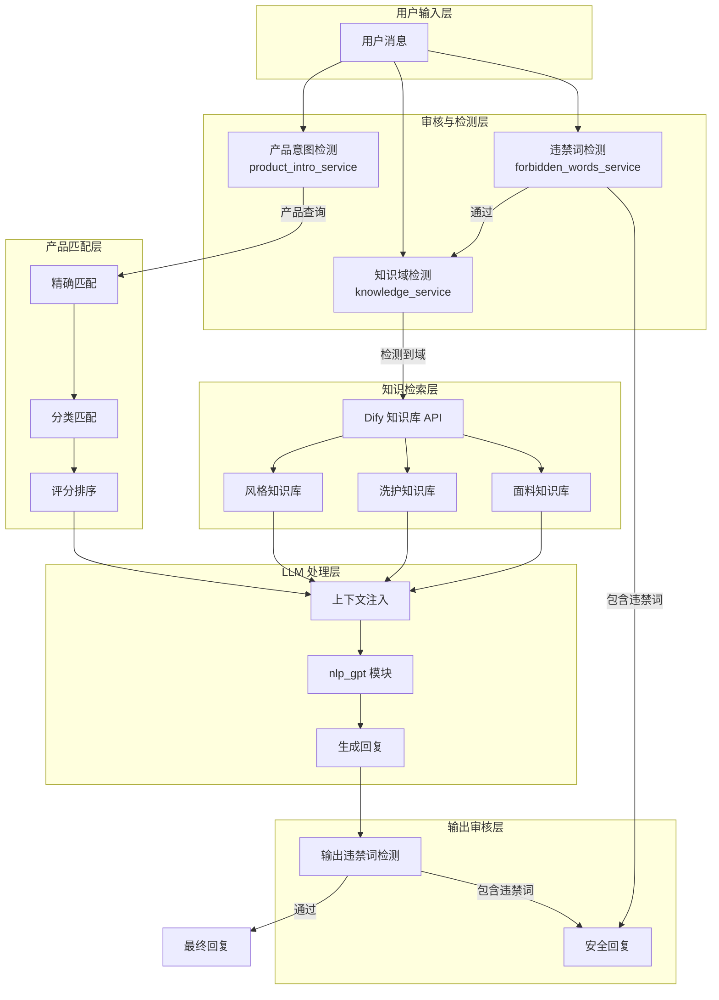
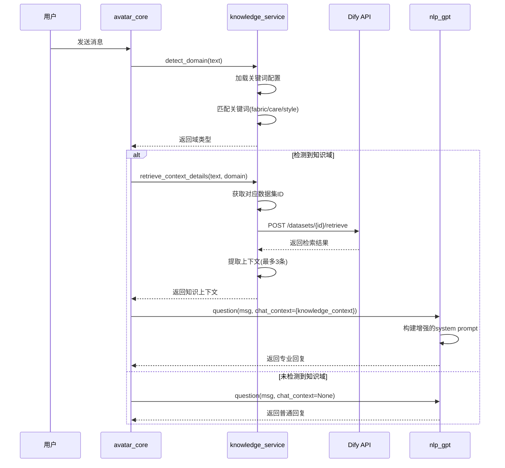
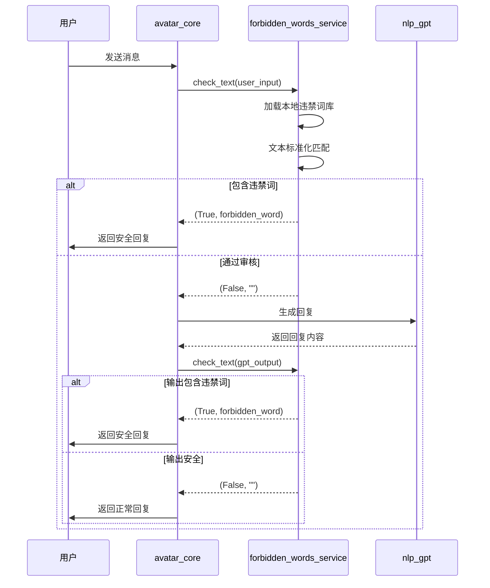

## 1. 高层摘要 (TL;DR)
2026.4.18
*   **影响范围:** 🟢 **中等** - 为直播数字人系统新增知识库检索和违禁词审核能力,提升专业性和合规性
*   **核心变更:**
    *   ✨ 新增 **Dify 知识库集成**,支持面料、洗护、风格等专业知识检索
    *   🛡️ 新增 **违禁词审核服务**,支持本地快速匹配和从 Dify 同步
    *   🎯 增强 **产品匹配算法**,支持更智能的商品查询和分类匹配
    *   🔧 优化 **LLM 上下文注入**,根据场景动态调整 system prompt
    *   📡 新增 **管理 API 接口**,支持刷新违禁词和查看知识库状态

---

## 2. 视觉概览 (架构与流程图)

### 2.1 整体架构流程



### 2.2 知识库检索流程



### 2.3 违禁词审核流程



---

## 3. 详细变更分析

### 3.1 新增服务模块

#### 📁 **backend/services/forbidden_words_service.py** (新增)

**功能:** 违禁词审核服务,提供本地快速匹配能力

**核心函数:**

| 函数名 | 功能描述 |
|--------|----------|
| `normalize_text(text)` | 文本标准化:去除空格、标点、转小写 |
| `load_local_words(force=False)` | 从本地文件加载违禁词,支持强制刷新 |
| `check_text(text)` | 检查文本是否包含违禁词,返回(是否包含, 匹配词) |
| `reload_words()` | 重新加载违禁词(用于API接口) |
| `get_stats()` | 获取违禁词统计信息 |

**关键特性:**
- ✅ 线程安全的缓存机制 (`threading.RLock`)
- ✅ 支持环境变量配置文件路径 (`FORBIDDEN_WORDS_FILE`)
- ✅ 自动文本标准化,支持中英文混合匹配
- ✅ 详细的统计和状态查询接口

---

#### 📁 **backend/services/knowledge_service.py** (新增)

**功能:** 知识库检索服务,集成 Dify API 进行专业知识检索

**核心函数:**

| 函数名 | 功能描述 |
|--------|----------|
| `should_enhance(text)` | 判断是否需要知识库增强 |
| `detect_domain(text)` | 检测用户问题所属域(fabric/care/style) |
| `retrieve_context_details(text, domain)` | 从 Dify 检索知识上下文(详细版) |
| `retrieve_context(text, domain)` | 从 Dify 检索知识上下文(简化版) |
| `get_status(force_refresh)` | 获取知识库状态和数据集匹配情况 |

**知识域配置:**

| 域 | 关键词示例 | 用途 |
|----|-----------|------|
| `fabric` | 面料、材质、透气、柔软、亲肤 | 面料知识 |
| `care` | 洗护、清洗、怎么洗、机洗、手洗 | 洗护知识 |
| `style` | 风格、搭配、穿搭、适合、场合 | 风格搭配 |

**关键特性:**
- ✅ 数据集自动发现和匹配(通过名称/描述匹配)
- ✅ 缓存机制(默认TTL 300秒)
- ✅ 支持重排序模型 (`BAAI/bge-reranker-v2-m3`)
- ✅ 混合检索模式(语义+关键词)
- ✅ 详细的追踪日志和错误处理
- ✅ 支持环境变量配置 (`DIFY_DATASET_API_KEY`, `DIFY_API_BASE_URL`)

---

### 3.2 产品匹配服务增强

#### 📁 **backend/services/product_intro_service.py** (修改)

**主要变更:**

1. **新增智能匹配算法:**
   - `_score_product_candidate()`: 综合评分算法(名称、特征、描述、分类)
   - `_is_weak_product_query()`: 识别弱查询(如"这件衣服怎么样")
   - `_extract_category_style_terms()`: 提取分类和风格术语
   - `_match_category_candidates()`: 基于分类匹配商品

2. **新增查询模式:**
   - `match_product_from_query()`: 从自然语言查询中匹配商品
   - 支持多场景匹配:精确匹配、分类匹配、评分排序

3. **新增回复模式:**
   - `build_product_question_prompt()`: 构建商品问答提示词
   - `build_multiple_matches_reply()`: 构建多候选商品确认回复
   - 新增 `response_mode` 字段: `product_intro`, `product_qa`, `product_multiple`

**评分权重表:**

| 匹配类型 | 基础分 | 权重 | 说明 |
|---------|--------|------|------|
| 完全匹配名称 | 120 | - | 精确匹配商品名 |
| 标准化完全匹配 | 110 | - | 去除标点后完全匹配 |
| 名称包含查询 | 95 | - | 商品名包含查询词 |
| 查询包含名称 | 80 | - | 查询词包含商品名 |
| 名称token重叠 | - | 60 | 名称关键词重叠率 |
| 特征token重叠 | - | 18 | 商品特征重叠率 |
| 描述token重叠 | - | 12 | 描述重叠率 |
| 分类token重叠 | - | 10 | 分类重叠率 |

---

### 3.3 核心集成层

#### 📁 **core/avatar_core.py** (修改)

**主要变更:**

1. **新增导入:**
```python
from backend.services.forbidden_words_service import check_text as check_forbidden_text
from backend.services.knowledge_service import detect_domain as detect_knowledge_domain
from backend.services.knowledge_service import retrieve_context_details as retrieve_knowledge_context_details
from backend.services.knowledge_service import should_enhance as should_knowledge_enhance
```

2. **新增导购身份识别:**
```python
GUIDE_IDENTITY_REPLY = "我是这边的导购助手..."
GUIDE_IDENTITY_QUERIES = ("你是谁", "介绍一下你自己", "你能做什么", ...)
def get_guide_identity_reply(text: str) -> str
```

3. **处理流程重构:**
   - **输入审核**: 检查用户输入是否包含违禁词
   - **身份识别**: 识别"你是谁"等身份查询
   - **产品匹配**: 调用增强的产品匹配服务
   - **知识检索**: 根据域检测检索专业知识
   - **LLM调用**: 传递知识上下文和产品上下文
   - **输出审核**: 检查LLM输出是否包含违禁词

**新增追踪日志:**
- `audit_input`: 输入审核状态
- `audit_output`: 输出审核状态
- `knowledge`: 知识库检索状态

---

#### 📁 **llm/nlp_gpt.py** (重构)

**主要变更:**

1. **函数签名更新:**
```python
def question(cont, uid=0, chat_context=None, has_product_context=None)
```

2. **新增上下文处理:**
```python
def _get_knowledge_context(chat_context)
def _has_explicit_product_context(prompt_text)
def _detect_product_mode(prompt_text)
```

3. **智能提示词构建:**
   - `_build_product_context_system_prompt()`: 有产品上下文时的提示词
   - `_build_fallback_clarify_system_prompt()`: 无产品上下文时的提示词
   - `_build_product_style_instruction()`: 根据产品模式构建风格指令

4. **新增防护机制:**
   - `_should_replace_fallback_reply()`: 检测并替换不安全的回退回复
   - `_FALLBACK_PRODUCT_PATTERN`: 正则表达式,防止模型编造具体商品

**产品模式分类:**

| 模式 | 触发条件 | 回复风格 |
|------|---------|---------|
| `product_intro` | "介绍商品"或"最值得关注的亮点" | 亮点、卖点、推荐感 |
| `product_material` | 面料、洗护相关关键词 | 专业、可信、实用 |
| `product_style` | 风格、穿搭、场景相关 | 场景推荐、穿搭建议 |
| `product_qa` | 有商品上下文但无特殊关键词 | 导购感,重点回答问题 |

---

### 3.4 配置与API

#### 📁 **config/knowledge_keywords.json** (新增)

**知识域配置结构:**
```json
{
  "fabric": {
    "description": "Fabric, material, and texture related questions.",
    "keywords": ["面料", "材质", "透气", "柔软", ...],
    "dataset_aliases": ["fabric", "material", "面料", "材质", ...]
  },
  "care": { ... },
  "style": { ... }
}
```

---

#### 📁 **utils/config_util.py** (修改)

**新增配置项:**

| 配置项 | 类型 | 默认值 | 说明 |
|--------|------|--------|------|
| `audit_enabled` | bool | `True` | 是否启用审核 |
| `audit_input_enabled` | bool | `True` | 是否启用输入审核 |
| `audit_output_enabled` | bool | `True` | 是否启用输出审核 |
| `audit_fallback_reply` | str | "这个问题我不太方便回答..." | 违禁词回退回复 |
| `knowledge_enabled` | bool | `False` | 是否启用知识库 |
| `knowledge_for_gpt_only` | bool | `True` | 是否仅GPT使用知识库 |
| `knowledge_timeout_ms` | int | `3000` | 知识库检索超时(毫秒) |

---

#### 📁 **gui/aigc_server.py** (修改)

**新增API接口:**

| 接口 | 方法 | 功能 |
|------|------|------|
| `/api/admin/forbidden-words/status` | GET | 获取违禁词状态 |
| `/api/admin/forbidden-words/reload` | POST | 刷新违禁词库 |
| `/api/admin/knowledge/status` | GET | 获取知识库状态 |

---

#### 📁 **runtime/forbidden_words.txt** (新增)

**用途:** 本地违禁词缓存文件,每行一个违禁词

**示例内容:**
```
违禁词1
不可言说之物
```

---

## 4. 影响与风险评估

### 4.1 ⚠️ 破坏性变更

| 变更项 | 影响 | 缓解措施 |
|--------|------|---------|
| `nlp_gpt.question()` 函数签名变更 | 需要更新所有调用点 | 已在 `avatar_core.py` 中适配 |
| 新增配置项 | 需要在 `system.conf` 中配置 | 提供默认值,向后兼容 |
| 知识库依赖 | 需要 Dify API Key | 提供 `knowledge_enabled` 开关 |

### 4.2 🔍 测试建议

**功能测试:**
1. ✅ **违禁词检测:**
   - 测试输入包含违禁词的场景
   - 测试输出包含违禁词的场景
   - 验证回退回复是否正确显示

2. ✅ **知识库检索:**
   - 测试"面料透气性"等面料相关问题
   - 测试"怎么洗"等洗护相关问题
   - 测试"适合什么场合"等风格问题
   - 验证知识上下文是否正确注入到LLM

3. ✅ **产品匹配:**
   - 测试精确商品名匹配
   - 测试模糊查询(如"那件红色的")
   - 测试分类查询(如"短袖上衣")
   - 验证多候选商品的确认流程

4. ✅ **API接口:**
   - 测试 `/api/admin/forbidden-words/reload`
   - 测试 `/api/admin/knowledge/status`
   - 验证返回数据格式正确

**性能测试:**
- ⏱️ 知识库检索延迟(目标: <3秒)
- ⏱️ 违禁词匹配延迟(目标: <10ms)
- ⏱️ 并发场景下的缓存效果

**边界测试:**
- 🚫 Dify API 不可用时的降级处理
- 🚫 知识库配置文件缺失时的行为
- 🚫 违禁词文件为空时的行为
- 🚫 网络超时场景的处理

### 4.3 📊 配置检查清单

**环境变量:**
- [ ] `DIFY_DATASET_API_KEY` - Dify 数据集 API Key
- [ ] `DIFY_API_BASE_URL` - Dify API 基础URL(可选)
- [ ] `DIFY_DATASET_CACHE_TTL_SECONDS` - 缓存TTL(可选)
- [ ] `DIFY_RERANKING_PROVIDER_NAME` - 重排序提供商(可选)
- [ ] `DIFY_RERANKING_MODEL_NAME` - 重排序模型(可选)
- [ ] `FORBIDDEN_WORDS_FILE` - 违禁词文件路径(可选)

**system.conf 配置:**
- [ ] `audit_enabled` - 审核开关
- [ ] `audit_input_enabled` - 输入审核开关
- [ ] `audit_output_enabled` - 输出审核开关
- [ ] `audit_fallback_reply` - 违禁词回退回复
- [ ] `knowledge_enabled` - 知识库开关
- [ ] `knowledge_for_gpt_only` - GPT专用知识库
- [ ] `knowledge_timeout_ms` - 知识库超时

---

## 5. 总结

本次更新为直播数字人系统增加了两大核心能力:

1. **🧠 知识库增强**: 通过 Dify API 检索面料、洗护、风格等专业知识,大幅提升回答的专业性和准确性
2. **🛡️ 违禁词审核**: 本地快速匹配 + 远程同步,确保直播内容合规安全

同时优化了产品匹配算法,支持更智能的商品查询和分类匹配。所有功能都提供了详细的配置选项和追踪日志,便于运维和调试。

**建议后续优化方向:**
- 📈 知识库检索结果的质量评估和反馈机制
- 🎯 产品匹配算法的持续优化(基于用户行为数据)
- 🔍 违禁词库的定期更新和版本管理
- 📊 知识库命中率和效果的监控面板