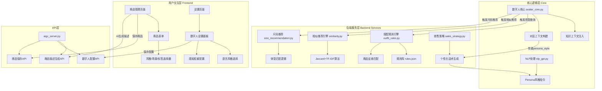

## 1. 高层摘要 (TL;DR)

*   **影响范围**: 🟢 **高** - 新增智能搭配推荐引擎、相似商品推荐、数字人个性化配置三大核心功能
*   **关键变更**:
    *   ✨ 新增 **搭配规则引擎** (`outfit_rules.py` + `rules.json`)，基于9种风格×6种场景的专家规则自动生成搭配建议
    *   ✨ 新增 **相似商品推荐** (`similarity.py`)，使用 Jaccard 相似度 + TF-IDF 加权算法推荐相似商品
    *   ✨ 新增 **数字人设置页面**，支持配置语言风格（轻快活泼/专业理性/自然随和）和交互感知权重
    *   🔧 商品管理界面新增 **风格、场景、标签** 字段，支持 AI 自动生成
    *   🎯 优化尺码推荐逻辑，增加价格和体重范围展示

---

## 2. 可视化概览 (代码与逻辑图)



---

## 3. 详细变更分析

### 🎨 3.1 搭配规则引擎 (新增)

**组件**: `backend/services/outfit_rules.py` + `backend/services/rules.json`

**功能说明**: 基于专家规则库自动生成服装搭配建议，并反查店内在售商品

**核心方法**:

| 方法名 | 功能 | 返回值 |
|--------|------|--------|
| `get_outfit_recommendation(product)` | 根据商品属性生成搭配建议 | `(text: str, keywords: list[str])` |
| `find_matching_products(keywords, products)` | 从商品库中查找匹配商品 | `list[dict]` |
| `build_full_outfit_context(product, all_products)` | 构建完整搭配上下文（含在售商品） | `str` |

**规则库结构** (`rules.json`):

```json
{
  "style": {
    "甜辣": {"shoes": "短靴或马丁靴", "bottoms": "高腰牛仔裤或百褶短裙", ...},
    "法式": {"shoes": "尖头单鞋或细跟凉鞋", "bottoms": "直筒西裤或A字半裙", ...},
    ...
  },
  "scene": {
    "约会": {"tip": "精致配饰+小号手包，整体色调温柔不跳脱", ...},
    "通勤": {"tip": "加一件西装外套或针织开衫，提升正式感", ...},
    ...
  },
  "fit": {"修身": {...}, "宽松": {...}, "oversized": {...}},
  "color": {"白色": "...", "黑色": "...", ...}
}
```

**触发逻辑** (Source: `core/avatar_core.py`):
```python
_outfit_triggers = ("搭配", "怎么搭", "配什么", "怎么配", "怎么穿", "好搭")
if has_product_context and any(kw in original_msg for kw in _outfit_triggers):
    outfit_text = build_full_outfit_context(intro_resolution["matched_product"], all_prods)
```

---

### 🔍 3.2 相似商品推荐引擎 (新增)

**组件**: `backend/services/similarity.py`

**算法**: Jaccard 相似度 + TF-IDF 加权

**核心逻辑**:

```python
def _weighted_jaccard(features_a: set, features_b: set, weights: dict) -> float:
    intersection = features_a & features_b
    union = features_a | features_b
    w_inter = sum(weights.get(f, 1.0) for f in intersection)
    w_union = sum(weights.get(f, 1.0) for f in union)
    return w_inter / w_union
```

**特征提取**: 从商品中提取 `style`、`fit`、`tags`、`scene` 等属性构建特征集合

**触发关键词**: "相似"、"类似"、"推荐"、"还有"、"同款"、"看看别的"

**输出示例**:
```
【相似推荐】
- 美式复古斜肩短袖T恤 · 美式复古
- 法式碎花连衣裙 · 法式 199元
请自然地在回答中向用户提及以上相似商品，但不要生硬罗列。
```

---

### 🤖 3.3 数字人个性化配置 (新增)

**组件**: 
- `frontend/components/settings/digital-human-settings.tsx` (UI)
- `gui/aigc_server.py` (API)
- `llm/nlp_gpt.py` (Persona 指令构建)

**语言风格选项**:

| 风格ID | 标签 | 特点 |
|--------|------|------|
| `vtuber_light` | 轻快活泼（Vtuber风） | 语气活泼有感染力，称呼"姐妹们"，使用"绝绝子"、"冲呀"等直播用语 |
| `professional` | 专业理性 | 用词准确，先给结论再给理由，禁止口语化表达 |
| `natural` | 自然随和 | 像朋友日常聊天，句式简短口语化 |

**API 端点**:

| 方法 | 路径 | 功能 |
|------|------|------|
| GET | `/api/runtime-config/digital-human` | 获取数字人配置 |
| POST | `/api/runtime-config/digital-human` | 保存数字人配置 |

**配置字段**:

```typescript
interface AttributeState {
  name: string
  gender: string
  age: string
  job: string
  hobby: string
  voice: string
  personaStyle: string  // 语言风格
}

interface PerceptionState {
  chat: number      // 对话互动权重
  follow: number    // 关注权重
  gift: number      // 礼物权重
  indifferent: number // 冷淡权重
  join: number      // 进入直播间权重
}
```

**Persona 指令构建** (Source: `llm/nlp_gpt.py`):
```python
def _build_persona_instruction(person_info):
    style = person_info.get("persona_style")
    if style == "professional":
        return "说话方式：专业理性，用词准确，先给结论再给理由..."
    elif style == "natural":
        return "说话方式：像朋友日常聊天，自然随和..."
    else:  # vtuber_light
        return "说话方式：语气活泼有感染力，像直播间里一位元气满满的主播..."
```

---

### 📦 3.4 商品管理增强

**组件**: `frontend/components/products/` + `frontend/lib/types/product.ts`

**新增字段**:

| 字段 | 类型 | 说明 | 示例 |
|------|------|------|------|
| `style` | string | 风格 | "甜辣"、"法式"、"美式复古" |
| `scene` | string[] | 适用场景 | ["约会", "日常"] |
| `tags` | string[] | 营销标签 | ["显瘦", "百搭", "气质"] |

**AI 自动生成增强** (Source: `gui/aigc_server.py`):

```python
prompt = (
    "请根据以下商品信息完成以下任务，并严格按JSON格式输出：\n\n"
    "1. 生成一段100-200字的电商商品描述\n"
    "2. 判断商品风格（从以下选1个）：甜辣、法式、美式复古、通勤、休闲、简约、新中式、山系、Y2K、其他\n"
    "3. 判断适用场景（可多选）：约会、通勤、日常、度假、运动、派对\n"
    "4. 提取营销标签（3-5个，如：显瘦、百搭、气质、少女感、高级感）\n\n"
    f"商品名称：{name}\n"
    f"商品类别：{category}\n"
    f"商品特点：{features or '暂无'}\n\n"
    '{"description":"...", "style":"...", "scene":["...","..."], "tags":["...","..."]}'
)
```

**UI 改进**:
- 将 `Chip` 组件替换为原生 `button`，提升自定义样式能力
- 新增风格下拉选择器
- 新增场景标签多选按钮组
- 新增营销标签多选按钮组

---

### 📏 3.5 尺码推荐优化

**组件**: `backend/services/size_recommendation.py`

**代码重构**:
- 提取辅助函数 `_get_raw_info()` 和 `_get_size_chart_from_raw()` 减少重复代码
- 优化展示格式，增加价格和体重范围信息

**输出格式改进**:

| 旧格式 | 新格式 |
|--------|--------|
| `- 商品名称（推荐M码）` | `- 商品名称 \| 推荐M码 \| 价格199 \| 建议体重50-60kg` |

**限制调整**:
- 匹配商品数量从 3 个减少到 2 个，避免信息过载

---

### ⚙️ 3.6 其他技术改进

**类型注解优化** (Source: `utils/config_util.py`):
```python
# 旧代码
config: json = None
system_config: ConfigParser = None

# 新代码
config: dict | None = None
system_config: ConfigParser | None = None
```

**类型安全增强** (Source: `gui/aigc_server.py`):
```python
# 为所有第三方库导入添加 type: ignore 注解
import numpy as np  # type: ignore[import-untyped]
import pandas as pd  # type: ignore[import-untyped]
```

**Bug 修复**:
- 修复 `nlp_gpt.py` 中星座字段错误引用 (`person_info['age']` → `person_info.get('constellation', '')`)
- 修复 `aigc_server.py` 中 `img2img_handler` 未初始化的潜在问题
- 修复 `aigc_server.py` 中 `save_product` 丢弃 `style`/`scene`/`tags` 字段，导致商品保存后标签丢失
- 修复编辑回显和保存时 `sizes` Chip 区域与 `size_chart` 表格不同步的问题——现在自动从表格推导 Chip 选中状态

**Prompt 精简** (Source: `llm/nlp_gpt.py`):
移除了 `has_product_context` 分支中的 11 条历史对话注入逻辑（`content_db` → `message.append`），每次 LLM 调用不再携带最近聊天记录。搭配已有的商品上下文模糊指代匹配（180s TTL），商品信息仍能精准传递，同时减少 1000-3000 字 prompt 开销。

---

## 4. 影响与风险评估

### ⚠️ 4.1 破坏性变更

| 变更类型 | 影响范围 | 说明 |
|----------|----------|------|
| **数据结构扩展** | 商品数据模型 | 新增 `style`、`scene`、`tags` 字段，旧数据需兼容处理 |
| **API 扩展** | 商品描述生成 | 返回值从 `{description}` 变为 `{description, style, scene, tags}` |
| **配置结构** | 数字人配置 | 新增 `persona_style` 字段，需在配置文件中添加 |

### ✅ 4.2 测试建议

#### 功能测试
1. **搭配推荐测试**:
   - 测试不同风格（甜辣、法式、Y2K等）的搭配建议生成
   - 验证商品反查功能是否正确匹配店内在售商品
   - 测试触发关键词："怎么搭"、"配什么"、"好搭"

2. **相似推荐测试**:
   - 验证相似商品推荐的准确性（基于风格、标签、场景）
   - 测试边界情况：无相似商品时的处理

3. **数字人配置测试**:
   - 测试三种语言风格的切换效果
   - 验证感知权重调整是否生效
   - 测试配置保存和加载功能

4. **商品管理测试**:
   - 测试 AI 自动生成风格、场景、标签功能
   - 验证新增字段的保存和编辑
   - 测试旧商品数据的兼容性

#### 性能测试
- 测试搭配规则引擎的响应时间（规则库加载、匹配计算）
- 测试相似推荐算法在大商品库下的性能
- 验证 TF-IDF 权重计算效率

#### 集成测试
- 测试数字人配置与对话生成的联动
- 验证知识上下文注入的正确性
- 测试多场景下的推荐逻辑

---

## 5. 总结

本次更新为 AIGC 电商系统引入了三大核心智能功能：

1. **🎨 智能搭配推荐** - 基于专家规则库自动生成搭配建议，提升导购专业性
2. **🔍 相似商品推荐** - 使用算法推荐相似商品，促进交叉销售
3. **🤖 数字人个性化** - 支持多种语言风格和交互配置，提升用户体验

这些功能通过模块化设计实现，易于扩展和维护。建议在上线前进行充分的集成测试，确保各模块协同工作正常。