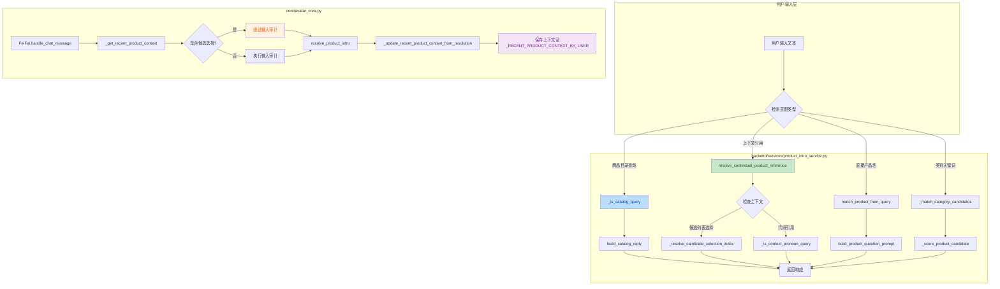
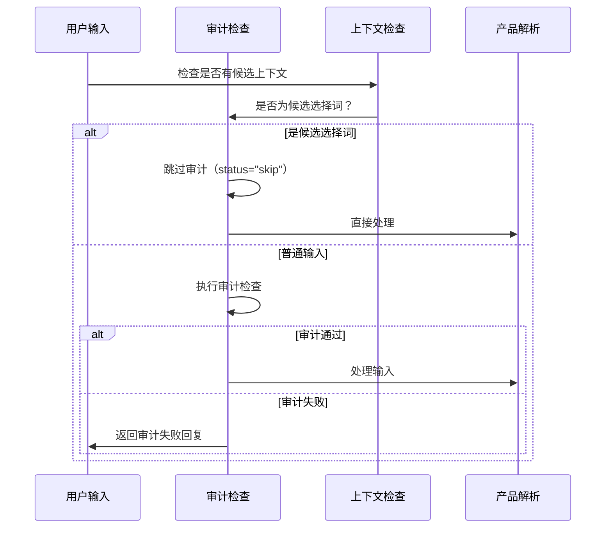

## 1. 高层摘要（TL;DR）

*   **影响：** **高** - 大幅增强了电商直播助手的产品交互能力，支持上下文引用、候选产品选择和商品目录查询
*   **关键变更：**
    *   ✨ 新增**商品目录查询**功能，用户可询问"我们有什么商品"
    *   ✨ 新增**上下文引用解析**，支持"第一个"、"这款"等指代词
    *   ✨ 新增**候选产品选择**机制，支持从多个匹配结果中选择
    *   ✨ 新增**产品上下文记忆**，TTL为180秒
    *   🔧 改进类别匹配逻辑，支持单术语匹配（如"短袖"）
    *   🐛 前端音频超时从30秒增加到60秒

---

## 2. 可视化概览（代码与逻辑图）



**业务流程说明：**

1. **用户输入** → **意图检测** → **分发处理**
2. **商品目录查询**：识别"我们有什么商品"等查询，返回商品列表
3. **上下文引用**：
   - 检查是否有候选列表（如多个匹配结果）
   - 识别"第一个"、"第二个"等选择词
   - 识别"这款"、"那件"等代词
4. **上下文记忆**：保存最近匹配的产品和候选列表，TTL 180秒

---

## 3. 详细变更分析

### 📦 组件一：产品介绍服务（`backend/services/product_intro_service.py`）

#### 🎯 新增功能

**1. 商品目录查询识别**

| 功能 | 说明 | 源码位置 |
|------|------|----------|
| 正则表达式 `_CATALOG_QUERY_RE` | 匹配"我们有什么商品"等查询 | 第15-18行 |
| 函数 `_is_catalog_query()` | 多维度判断是否为目录查询 | 第293-323行 |
| 函数 `build_catalog_reply()` | 生成商品目录回复 | 第833-845行 |

**支持的查询模式：**
- "介绍/看看 + 有什么/有哪些 + 商品"
- "我们/现有/已有 + 商品"
- "介绍/看看 + 现有/已有 + 商品"

**2. 上下文引用解析**

| 功能 | 说明 | 源码位置 |
|------|------|----------|
| 代词识别 `_CONTEXT_PRONOUN_TOKENS` | 识别"这个"、"那件"、"这款"等 | 第62-112行 |
| 选择词识别 `_FIRST_CHOICE_TERMS` | 识别"第一个"、"1号"等 | 第113-126行 |
| 函数 `resolve_contextual_product_reference()` | 解析上下文引用 | 第901-929行 |

**3. 候选产品选择机制**

| 功能 | 说明 | 源码位置 |
|------|------|----------|
| 函数 `_resolve_candidate_selection_index()` | 解析选择索引（0或1） | 第873-883行 |
| 函数 `_strip_selection_tokens()` | 移除选择词，保留问题 | 第886-891行 |
| 函数 `_is_selection_intro_request()` | 判断是否为介绍请求 | 第894-898行 |

#### 🔧 改进功能

**1. 类别匹配增强**

| 改进项 | 旧逻辑 | 新逻辑 | 源码位置 |
|--------|--------|--------|----------|
| 匹配要求 | 至少2个术语 | 支持单术语（如"短袖"） | 第525-528行 |
| 单术语列表 | 无 | 新增 `_SINGLE_TERM_CATEGORY_TERMS` | 第53-56行 |

**2. 响应结构统一**

新增 `_build_resolution()` 辅助函数（第235-255行），统一构建响应结构：
```python
{
    "handled": bool,
    "llm_input": str | None,
    "reply_text": str | None,
    "matched_product": dict | None,
    "allow_knowledge_enhance": bool,
    "response_mode": str | None,
    "context_source": str | None,  # 新增
    "candidate_products": list | None,  # 新增
}
```

#### 📊 新增响应模式

| 响应模式 | 触发条件 | 说明 |
|----------|----------|------|
| `product_catalog` | 目录查询 | 返回商品列表 |
| `product_qa` | 上下文引用问答 | 基于上下文回答问题 |
| `context_candidate_selection` | 候选列表选择 | 从多个候选中选择 |
| `context_pronoun` | 代词引用 | 使用代词引用最近产品 |

---

### 🤖 组件二：Avatar核心（`core/avatar_core.py`）

#### 🎯 新增功能

**1. 问候语识别**

| 功能 | 说明 | 源码位置 |
|------|------|----------|
| 常量 `GUIDE_GREETING_QUERIES` | 包含"你好"、"hello"等 | 第93-100行 |
| 增强 `get_guide_identity_reply()` | 支持问候语返回身份介绍 | 第109-111行 |

**2. 产品上下文记忆系统**

| 功能 | 说明 | 源码位置 |
|------|------|----------|
| 常量 `_RECENT_PRODUCT_CONTEXT_TTL_SECONDS` | 上下文TTL为180秒 | 第116行 |
| 字典 `_RECENT_PRODUCT_CONTEXT_BY_USER` | 存储用户上下文 | 第117行 |
| 函数 `_build_user_context_key()` | 构建用户上下文键 | 第141-144行 |
| 函数 `_get_recent_product_context()` | 获取用户上下文 | 第147-157行 |
| 函数 `_set_recent_product_context()` | 设置用户上下文 | 第160-180行 |
| 函数 `_update_recent_product_context_from_resolution()` | 从解析结果更新上下文 | 第183-202行 |

**上下文存储结构：**
```python
{
    "last_matched_product": dict | None,  # 最近匹配的产品
    "last_candidates": list[dict],        # 最近候选列表（最多2个）
    "last_response_mode": str | None,      # 最后响应模式
    "updated_at": float,                   # 更新时间戳
}
```

**3. 候选选择审计绕过**

| 功能 | 说明 | 源码位置 |
|------|------|----------|
| 常量 `_CANDIDATE_SELECTION_BYPASS_TERMS` | 可绕过审计的选择词 | 第119-138行 |
| 函数 `_should_bypass_input_audit_for_candidate_selection()` | 判断是否绕过审计 | 第209-219行 |

**绕过条件：**
- 用户有候选列表上下文
- 输入为"第一个"、"第二个"等选择词

#### 🔧 改进功能

**1. 输入审计流程优化**



**2. 产品解析流程增强**

| 改进项 | 说明 | 源码位置 |
|--------|------|----------|
| 传入上下文 | `resolve_product_intro()` 新增 `conversation_context` 参数 | 第439-442行 |
| 更新上下文 | 解析后更新用户上下文 | 第443行 |
| 增强日志 | 记录上下文来源和类型 | 第444-458行 |

---

### 🖥️ 组件三：前端直播页面（`frontend/app/live/page.tsx`）

#### 🔧 配置调整

| 配置项 | 旧值 | 新值 | 说明 |
|--------|------|------|------|
| `AUDIO_READY_TIMEOUT_MS` | 30000 | 60000 | 音频就绪超时从30秒增加到60秒 |

**影响：** 给音频加载更多时间，减少超时失败的可能性。

---

## 4. 影响与风险评估

### ⚠️ 破坏性变更

| 变更类型 | 影响 | 缓解措施 |
|----------|------|----------|
| `resolve_product_intro()` 新增参数 | 函数签名变化，向后兼容（参数有默认值） | 无需修改现有调用 |
| 响应结构新增字段 | 响应结构扩展 | 新增字段为可选，不影响现有逻辑 |

### ✅ 测试建议

#### 功能测试场景

1. **商品目录查询**
   - ✅ "我们有什么商品"
   - ✅ "看看现有的商品"
   - ✅ "介绍下我们店里有哪些衣服"
   - ✅ 空商品库时的回复

2. **上下文引用**
   - ✅ "第一个" / "第二个" 选择
   - ✅ "这款" / "那件" 代词引用
   - ✅ "第一个介绍一下" 组合查询
   - ✅ 上下文过期（180秒后）的行为

3. **类别匹配增强**
   - ✅ 单术语查询："短袖"、"衬衫"
   - ✅ 多术语查询："短袖 圆领 t恤"

4. **审计绕过**
   - ✅ 候选列表存在时输入"第一个"应绕过审计
   - ✅ 无候选列表时输入"第一个"应正常审计

5. **音频超时**
   - ✅ 验证60秒超时是否足够

#### 边界条件测试

- 🧪 商品列表为空
- 🧪 候选列表只有1个元素
- 🧪 用户ID为空或0
- 🧪 并发用户上下文隔离
- 🧪 上下文TTL过期清理

### 📊 性能影响

| 组件 | 影响 | 说明 |
|------|------|------|
| 内存 | 轻微增加 | 每用户存储上下文（约几KB） |
| 响应时间 | 轻微增加 | 上下文查询和更新开销 |
| 并发安全 | 已处理 | 使用 `threading.RLock()` 保护 |

---

## 5. 总结

本次变更大幅增强了电商直播助手的产品交互能力，主要体现在：

1. **更自然的对话体验**：支持"我们有什么商品"、"第一个介绍一下"等自然语言
2. **上下文感知**：记住最近的产品和候选列表，支持代词引用
3. **更灵活的匹配**：支持单术语类别查询
4. **更好的用户体验**：候选选择时绕过审计，减少误拦截

建议重点关注**上下文过期处理**和**并发用户隔离**的测试。