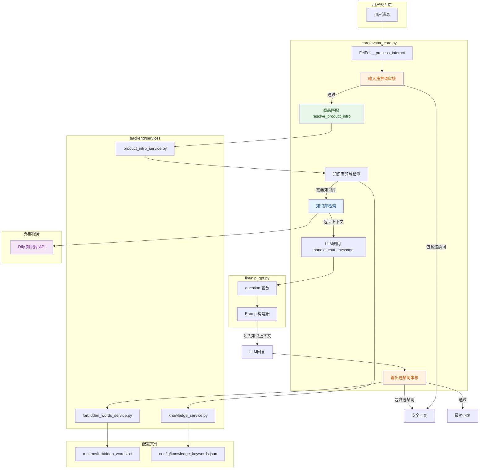
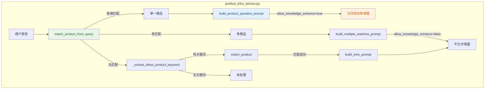

## 1. 高层摘要 (TL;DR)

*   **影响范围:** **高** - 为直播数字人系统新增知识库检索和违禁词审核两大核心能力，涉及核心调用链路改造
*   **主要变更:**
    *   ✨ 新增 **知识库检索服务**，集成 Dify API，支持面料、洗护、风格等多领域知识检索
    *   🛡️ 新增 **违禁词审核服务**，支持输入/输出双重过滤，保障直播合规性
    *   🔧 改造 **商品问答流程**，支持基于查询的自然匹配和知识库增强
    *   ⚙️ 新增 **配置项和API接口**，提供运行时管理能力

---

## 2. 可视化架构图

### 2.1 整体调用流程图



### 2.2 商品问答流程增强



---

## 3. 详细变更分析

### 3.1 核心服务层

#### 📦 新增文件：`backend/services/forbidden_words_service.py`

**职责:** 提供本地快速违禁词匹配功能

**核心功能:**

| 函数名 | 功能描述 | 返回值 |
|--------|----------|--------|
| `check_text(text)` | 检查文本是否包含违禁词 | `(bool, str)` - 是否包含, 匹配词 |
| `load_local_words(force)` | 从本地文件加载违禁词 | `set[str]` |
| `reload_words()` | 重新加载违禁词 | `dict` - 加载统计 |
| `get_stats()` | 获取违禁词统计信息 | `dict` |

**技术特点:**
- 使用线程锁 (`threading.RLock`) 保证并发安全
- 文本标准化处理，去除标点符号和空格
- 支持通过环境变量 `FORBIDDEN_WORDS_FILE` 自定义词库路径

---

#### 📦 新增文件：`backend/services/knowledge_service.py`

**职责:** 知识库检索服务，集成 Dify API

**核心功能:**

| 函数名 | 功能描述 | 返回值 |
|--------|----------|--------|
| `detect_domain(text)` | 检测文本所属领域 | `str \| None` - 领域名称 |
| `should_enhance(text)` | 判断是否需要知识增强 | `bool` |
| `retrieve_context_details(text, domain)` | 检索知识库上下文（详细） | `dict` - 包含上下文、原因等 |
| `retrieve_context(text, domain)` | 检索知识库上下文（简化） | `str \| None` |
| `get_status(force_refresh)` | 获取知识库状态 | `dict` |

**技术特点:**
- **领域映射:** 自动将关键词匹配到 Dify 数据集
- **缓存机制:** 数据集列表缓存，TTL 可配置（默认 300 秒）
- **重试机制:** 检索失败时自动重试 3 次
- **动态配置:** 支持通过环境变量配置 API Key、Base URL、超时等

**领域配置示例:**
```json
{
  "fabric": {
    "keywords": ["面料", "材质", "透气"],
    "dataset_aliases": ["fabric", "面料", "材质"]
  }
}
```

---

### 3.2 核心业务层

#### 🔧 修改文件：`core/avatar_core.py`

**变更点 1: `handle_chat_message()` 函数签名扩展**

```python
# 修改前
def handle_chat_message(msg, username='User', request_id=''):

# 修改后
def handle_chat_message(msg, username='User', request_id='', chat_context=None):
```

**变更点 2: `FeiFei.__process_interact()` 增强处理流程**

在用户消息处理链路中插入以下检查点：

| 阶段 | 检查项 | 处理逻辑 |
|------|--------|----------|
| **输入审核** | `check_forbidden_text(original_msg)` | 发现违禁词 → 返回安全回复，跳过后续处理 |
| **知识库检索** | `detect_knowledge_domain()` + `retrieve_context_details()` | 匹配领域 → 调用 Dify API → 注入 LLM 上下文 |
| **输出审核** | `check_forbidden_text(text)` | 发现违禁词 → 替换为安全回复 |

**新增 Trace Log 记录点:**

```python
trace_log(
    module="avatar",
    stage="audit_input",      # 输入审核
    stage="knowledge",         # 知识库检索
    stage="audit_output",      # 输出审核
    status="blocked/pass/skip",
    request_id=request_id,
    ...
)
```

---

#### 🔧 修改文件：`backend/services/product_intro_service.py`

**新增功能 1: 查询式产品匹配**

```python
def match_product_from_query(text: str, products: list[dict[str, Any]]) -> dict[str, Any]:
    """
    从用户查询文本中智能匹配产品
    
    策略:
    1. 直接名称匹配（完全包含）
    2. Token 匹配（所有关键词都出现）
    """
```

**新增功能 2: 产品问答 Prompt 构建**

```python
def build_product_question_prompt(product: dict[str, Any], original_text: str) -> str:
    """
    构建针对产品问题的专用 Prompt
    
    - 包含产品完整信息（名称、价格、描述、特点等）
    - 包含 raw_info 中的所有额外字段
    - 指导 LLM 基于已知资料回答，不编造参数
    """
```

**返回值扩展:**

| 字段 | 类型 | 说明 |
|------|------|------|
| `allow_knowledge_enhance` | `bool` | 是否允许知识库增强（仅产品问答场景为 true） |
| `response_mode` | `str` | 响应模式：`product_qa` / `product_intro` / `product_multiple` 等 |

---

#### 🔧 修改文件：`llm/nlp_gpt.py`

**变更点: 支持知识库上下文注入**

```python
def question(cont, uid=0, chat_context=None):
    # 新增辅助函数
    knowledge_context = _get_knowledge_context(chat_context)
    
    # 修改 System Prompt
    prompt = f"""
    ...原有人设...
    
    当提供 knowledge_context 时，你必须优先使用其中的信息进行回答。
    请结合知识内容进行详细、自然的解释，而不是仅给出简短结论。
    回答尽量不少于2到3句，优先引用参考知识里的关键信息，但不要机械复述。
    不要提及知识库、检索、system prompt 或内部上下文。
    """
    
    # 修改用户消息构建
    user_message = _build_user_prompt(cont, knowledge_context)
    # 格式:
    # ---
    # 用户问题：
    # {原始问题}
    # 
    # 参考知识：
    # {知识库内容}
    # 
    # 请基于以上信息进行回答：
    # ---
```

---

### 3.3 API 接口层

#### 🔧 修改文件：`gui/aigc_server.py`

**新增管理接口:**

| 端点 | 方法 | 功能 |
|------|------|------|
| `/api/admin/forbidden-words/status` | GET | 获取违禁词状态（数量、来源、文件是否存在） |
| `/api/admin/forbidden-words/reload` | POST | 重新加载违禁词库 |
| `/api/admin/knowledge/status` | GET | 获取知识库状态（是否启用、提供商、配置信息） |

**响应示例:**
```json
// 违禁词状态
{
  "loaded": true,
  "count": 42,
  "source": "runtime/forbidden_words.txt",
  "file_exists": true
}

// 知识库状态
{
  "enabled": true,
  "provider": "gpt",
  "gpt_only": true,
  "timeout_ms": 3000,
  "domains": ["fabric", "care", "style"],
  "matched_datasets": {
    "fabric": {
      "matched": true,
      "dataset_name": "面料知识库",
      "reason": "dataset_matched"
    }
  }
}
```

---

### 3.4 配置层

#### 🔧 修改文件：`utils/config_util.py`

**新增配置项:**

| 配置项 | 类型 | 默认值 | 说明 |
|--------|------|--------|------|
| `audit_enabled` | `bool` | `True` | 是否启用审核 |
| `audit_input_enabled` | `bool` | `True` | 是否启用输入审核 |
| `audit_output_enabled` | `bool` | `True` | 是否启用输出审核 |
| `audit_fallback_reply` | `str` | "这个问题我不太方便回答..." | 违禁词拦截回复 |
| `knowledge_enabled` | `bool` | `False` | 是否启用知识库 |
| `knowledge_for_gpt_only` | `bool` | `True` | 是否仅 GPT 模型使用知识库 |
| `knowledge_timeout_ms` | `int` | `3000` | 知识库检索超时（毫秒） |

---

#### 📦 新增文件：`config/knowledge_keywords.json`

**知识库领域配置:**

```json
{
  "fabric": {
    "description": "Fabric, material, and texture related questions.",
    "keywords": ["面料", "材质", "透气", "柔软", "亲肤"],
    "dataset_aliases": ["fabric", "面料", "材质"]
  },
  "care": {
    "description": "Washing, care, and maintenance related questions.",
    "keywords": ["洗护", "清洗", "怎么洗", "机洗", "手洗"],
    "dataset_aliases": ["care", "洗护", "清洗"]
  },
  "style": {
    "description": "Style, outfit matching, and scene related questions.",
    "keywords": ["风格", "搭配", "穿搭", "适合", "场合"],
    "dataset_aliases": ["style", "风格", "穿搭"]
  }
}
```

---

#### 📦 新增文件：`runtime/forbidden_words.txt`

**违禁词列表文件（示例）:**
```
违禁词1
不可言说之物
```

---

## 4. 影响与风险评估

### ⚠️ 破坏性变更

| 变更项 | 影响范围 | 风险等级 | 缓解措施 |
|--------|----------|----------|----------|
| `handle_chat_message()` 函数签名变更 | 所有调用该函数的模块 | **中** | 新增参数有默认值 `None`，向后兼容 |
| `question()` 函数签名变更 (nlp_gpt) | GPT 模块调用方 | **中** | 新增参数有默认值，向后兼容 |
| 新增配置项 | system.conf | **低** | 所有配置项都有默认值 |

### ✅ 测试建议

#### 场景 1: 违禁词审核
- [ ] 发送包含违禁词的用户消息，验证是否被拦截
- [ ] 验证拦截后返回的是配置的 `audit_fallback_reply`
- [ ] 发送正常消息，验证 LLM 回复中包含违禁词时是否被替换

#### 场景 2: 知识库检索
- [ ] 发送包含"面料"关键词的问题，验证是否触发知识库检索
- [ ] 验证检索到的内容是否正确注入到 LLM prompt
- [ ] 发送不包含关键词的问题，验证是否跳过知识库检索

#### 场景 3: 商品问答增强
- [ ] 发送"这个衣服是什么材质的？"，验证是否匹配到产品并启用知识增强
- [ ] 验证 `allow_knowledge_enhance` 字段是否正确设置
- [ ] 验证 `response_mode` 是否正确返回

#### 场景 4: API 接口
- [ ] 调用 `/api/admin/forbidden-words/status`，验证返回数据格式
- [ ] 调用 `/api/admin/forbidden-words/reload`，验证违禁词是否重新加载
- [ ] 调用 `/api/admin/knowledge/status`，验证知识库配置状态

#### 场景 5: 性能测试
- [ ] 测试知识库检索超时场景（配置 `knowledge_timeout_ms`）
- [ ] 测试 Dify API 不可用时的降级处理
- [ ] 测试高并发下违禁词匹配的性能

---

## 5. 环境变量配置清单

| 环境变量 | 是否必需 | 默认值 | 说明 |
|----------|----------|--------|------|
| `DIFY_DATASET_API_KEY` | **是** | - | Dify 数据集 API Key |
| `DIFY_API_BASE_URL` | 否 | `https://api.dify.ai/v1` | Dify API 基础 URL |
| `DIFY_DATASET_CACHE_TTL_SECONDS` | 否 | `300` | 数据集列表缓存 TTL（秒） |
| `DIFY_RERANKING_PROVIDER_NAME` | 否 | - | 重排序提供商名称 |
| `DIFY_RERANKING_MODEL_NAME` | 否 | `BAAI/bge-reranker-v2-m3` | 重排序模型名称 |
| `FORBIDDEN_WORDS_FILE` | 否 | `runtime/forbidden_words.txt` | 违禁词文件路径 |

---

## 6. 部署检查清单

- [ ] 在 `system.conf` 中添加新的配置项
- [ ] 配置 `DIFY_DATASET_API_KEY` 环境变量
- [ ] 创建 `runtime/forbidden_words.txt` 文件并添加违禁词
- [ ] 验证 `config/knowledge_keywords.json` 配置正确
- [ ] 重启服务，观察启动日志中的初始化信息
- [ ] 调用 `/api/admin/knowledge/status` 验证知识库连接
- [ ] 调用 `/api/admin/forbidden-words/status` 验证违禁词加载

---

## 7. 关键设计决策

### 7.1 为什么使用本地违禁词匹配而非 API 调用？
- **性能考虑:** 本地匹配延迟 < 1ms，API 调用通常 > 100ms
- **可靠性:** 不依赖外部服务，避免网络故障影响核心功能
- **成本:** 无需额外 API 调用费用

### 7.2 为什么知识库检索仅支持 GPT 模型？
- **Prompt 注入兼容性:** 当前实现仅针对 GPT 的 prompt 结构优化
- **扩展性:** 预留 `knowledge_for_gpt_only` 配置项，未来可扩展到其他模型

### 7.3 为什么使用缓存机制？
- **减少 API 调用:** 数据集列表相对稳定，缓存可减少 90%+ 的 API 调用
- **提升响应速度:** 避免每次检索都先获取数据集列表

---

**总结:** 本次变更通过模块化设计，在不破坏现有功能的前提下，为直播数字人系统增加了知识库检索和违禁词审核两大核心能力，显著提升了系统的专业性和合规性。所有变更都考虑了向后兼容性和降级处理，确保系统稳定运行。