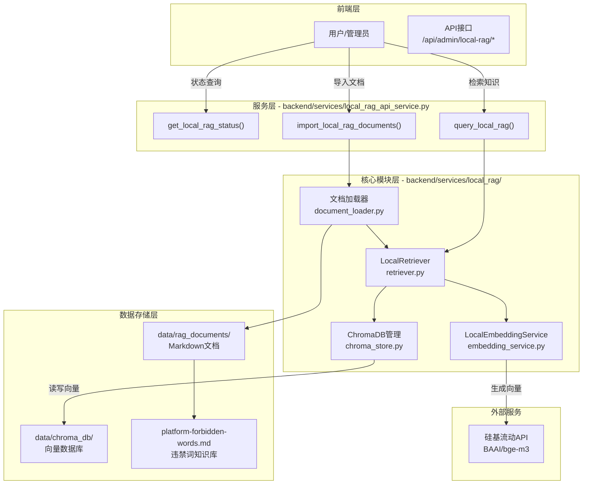
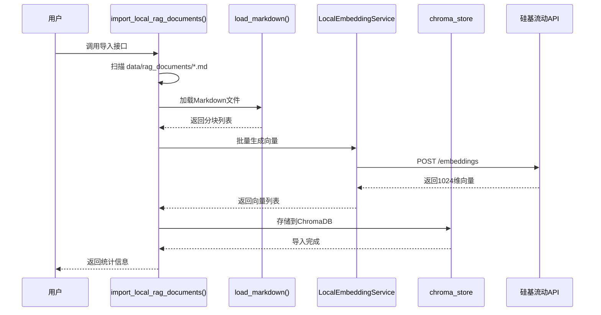

## 1. 高层摘要 (TL;DR)

*   **影响范围：** 🟡 **中等** - 新增完整的本地RAG向量知识库模块，不破坏现有功能
*   **核心变更：**
    *   ✨ 新增本地RAG服务模块（ChromaDB + 硅基流动Embedding）
    *   ✨ 新增文档导入和查询API接口
    *   ✨ 新增平台违禁词知识库文档（184行）
    *   ✨ 扩展违禁词列表（从2条扩展到160条）
    *   📝 新增技术方案文档和命令行工具

---

## 2. 可视化架构图

### 2.1 本地RAG系统架构



### 2.2 文档导入流程



---

## 3. 详细变更分析

### 3.1 核心服务模块

#### 📦 **backend/services/local_rag/** (新增模块)

| 文件 | 职责 | 核心函数 | 代码量 |
|------|------|---------|--------|
| `__init__.py` | 模块初始化 | 导出7个公共接口 | 15行 |
| `embedding_service.py` | Embedding服务 | `embed_documents()`, `embed_query()` | 105行 |
| `chroma_store.py` | 向量存储管理 | `add_documents()`, `query_documents()` | 110行 |
| `document_loader.py` | 文档加载与分块 | `load_markdown()` | 49行 |
| `retriever.py` | 知识检索器 | `retrieve()`, `add_documents()` | 161行 |

#### 🔧 **Embedding服务** (`embedding_service.py`)

**功能说明：**
- 调用硅基流动API（BAAI/bge-m3模型）生成1024维文本向量
- 支持批量Embedding和单条查询
- 实现指数退避重试机制（最多3次）

**关键配置：**

| 环境变量 | 必需 | 默认值 | 说明 |
|---------|------|--------|------|
| `LOCAL_RAG_API_KEY` | 是 | - | API密钥（兼容`SILICONFLOW_API_KEY`） |
| `LOCAL_RAG_EMBEDDING_MODEL` | 否 | `BAAI/bge-m3` | 模型名称 |
| `LOCAL_RAG_TIMEOUT_SECONDS` | 否 | 30 | 超时时间（秒） |

**错误处理：**
```python
# 指数退避重试机制
for attempt in range(3):
    try:
        response = requests.post(...)
        response.raise_for_status()
        break
    except (requests.RequestException, TimeoutError) as exc:
        if attempt == 2:
            trace_log(..., status="error", ...)
            raise
        time.sleep(2 ** attempt)  # 指数退避
```

#### 📊 **ChromaDB存储** (`chroma_store.py`)

**功能说明：**
- 管理ChromaDB PersistentClient
- 支持多领域隔离（通过collection前缀）
- 提供增删改查和统计接口

**核心函数：**

| 函数 | 参数 | 返回值 | 说明 |
|------|------|--------|------|
| `get_collection()` | domain, create | Collection | 获取或创建集合 |
| `add_documents()` | domain, ids, documents, embeddings, metadatas | None | 批量添加文档 |
| `query_documents()` | domain, query_embedding, top_k | dict | 向量相似度搜索 |
| `list_collections()` | - | list[str] | 列出所有集合 |
| `get_collection_stats()` | domain | dict | 获取集合统计信息 |
| `reset_collection()` | domain | None | 删除集合 |

**集合命名规则：**
```
{prefix}__{domain}
例如: local_rag__fabric
```

#### 📄 **文档加载器** (`document_loader.py`)

**分块策略：**
- 按Markdown三级标题（`###`）分割文档
- 每个标题及其内容作为一个独立知识块
- 自动提取元数据（source_file, section）

**返回结构：**
```python
[
    {
        "content": "棉纤维天然多孔，透气性极佳...",
        "metadata": {
            "source_file": "fabric_care.md",
            "section": "棉质面料"
        }
    }
]
```

#### 🔍 **检索器** (`retriever.py`)

**功能说明：**
- 集成Embedding服务和向量存储
- 支持自动领域检测（复用`knowledge_service.detect_domain()`）
- 提供降级机制（查询失败时回退到default域）

**检索流程：**
```python
def retrieve(query, domain=None, top_k=5):
    # 1. 解析领域
    active_domain = self._resolve_domain(query, domain)
    
    # 2. 生成查询向量
    query_embedding = self.embedding_service(query)
    
    # 3. 向量搜索
    raw = query_documents(active_domain, query_embedding, top_k)
    
    # 4. 组装结果（距离转相似度）
    score = 1 - distance  # 余弦距离转相似度
```

---

### 3.2 API服务层

#### 🌐 **backend/services/local_rag_api_service.py** (新增)

**新增API接口：**

| 端点 | 方法 | 功能 | 参数 |
|------|------|------|------|
| `/api/admin/local-rag/status` | GET | 获取RAG状态 | - |
| `/api/admin/local-rag/import` | POST | 导入文档 | domain, reset |
| `/api/admin/local-rag/query` | POST | 查询知识 | query, domain, top_k |

#### 📡 **GUI路由注册** (`gui/aigc_server.py`)

**变更内容：**
```python
# 新增导入
from backend.services.local_rag_api_service import (
    LocalRagApiError,
    get_local_rag_status,
    import_local_rag_documents,
    query_local_rag,
)

# 新增3个路由
@app.route("/api/admin/local-rag/status")
def api_local_rag_status():
    return jsonify(get_local_rag_status())

@app.route("/api/admin/local-rag/import", methods=["POST"])
def api_local_rag_import():
    # ... 处理导入请求

@app.route("/api/admin/local-rag/query", methods=["POST"])
def api_local_rag_query():
    # ... 处理查询请求
```

---

### 3.3 知识库内容

#### 📚 **data/rag_documents/platform-forbidden-words.md** (新增)

**文档结构：**
```markdown
# 平台违禁词与审核风险知识库

## 使用原则
## 通用高风险表达
  - 绝对化与极限词
  - 虚假承诺与效果保证
  - 引流与站外导流
  - 违法违规商品与服务

## 小红书相关审核风险
  - 夸张种草话术
  - 医疗与功效宣称
  - 软广与伪经验分享

## 抖音相关审核风险
  - 直播逼单话术
  - 收益诱导
  - 违规引流

## 微博相关审核风险
  - 谣言式表达
  - 拉踩与攻击
  - 诱导互动

## 重点敏感行业风险
  - 医疗健康类
  - 金融投资类
  - 招商加盟与培训类

## 改写建议
## 给审核模型的判断信号
## 维护建议
```

**文档特点：**
- 涵盖小红书、抖音、微博三大平台
- 按风险等级分类（高/中/低优先级）
- 提供安全替代表达建议
- 184行结构化知识内容

---

### 3.4 违禁词库扩展

#### ⚠️ **runtime/forbidden_words.txt** (大幅扩展)

**变更对比：**

| 指标 | 修改前 | 修改后 | 增长 |
|------|--------|--------|------|
| 词表条目数 | 2条 | 160条 | **+7900%** |
| 覆盖类别 | 通用 | 7大类 | - |

**新增违禁词分类：**

| 类别 | 示例词汇 | 数量 |
|------|---------|------|
| 绝对化极限词 | 最强、第一、顶级、国家级、永久有效 | 15条 |
| 虚假承诺 | 保证出单、稳赚不赔、轻松月入 | 12条 |
| 导流话术 | 加微、加V、站外下单、私域成交 | 18条 |
| 小红书风险 | 闭眼买、断货王、学生党必冲 | 10条 |
| 抖音风险 | 最后一分钟清仓、马上下架 | 8条 |
| 微博风险 | 内部消息、百分百实锤 | 10条 |
| 违法商品 | 违禁药品、外挂、赌博服务 | 87条 |

**新增敏感词汇示例：**
```txt
# 金融类
非法荐股、内幕票、老师带单、币圈翻倍、征信洗白

# 医疗类
治疗、治愈、根治、抗癌、抗肿瘤、处方级

# 违法服务
催情、迷药、代开发票、假证办理、枪支、弩

# 色情类
成人资源、成人视频、约炮、裸聊、色情网
```

---

### 3.5 命令行工具

#### 🛠️ **scripts/import_rag_docs.py** (新增)

**功能：** 批量导入Markdown文档到向量库

**使用方法：**
```bash
# 基本用法
python scripts/import_rag_docs.py

# 指定文档目录
python scripts/import_rag_docs.py --docs-dir /path/to/docs

# 指定领域
python scripts/import_rag_docs.py --domain fabric

# 重置后导入
python scripts/import_rag_docs.py --reset
```

**输出示例：**
```
domain: fabric
files: 2
chunks: 14
failed_files: 0
elapsed_ms: 1234.56
```

#### 🔎 **scripts/query_rag.py** (新增)

**功能：** 测试向量检索功能

**使用方法：**
```bash
# 基本查询
python scripts/query_rag.py "棉质面料透气吗？"

# 指定领域
python scripts/query_rag.py "怎么洗棉质衣服？" --domain care

# 指定返回数量
python scripts/query_rag.py "面料特性" --top-k 5
```

---

### 3.6 配置与文档

#### ⚙️ **.gitignore** (修改)

**变更内容：**
```diff
+.worktrees/
+skills-lock.json
+data/chroma_db/
```

**说明：** 忽略ChromaDB持久化数据目录，避免提交大文件到版本控制。

#### 📖 **docs/本地RAG向量知识库技术方案.md** (新增)

**文档结构（639行）：**

| 章节 | 内容 |
|------|------|
| 1. 设计目标 | 能力证明、零侵入、最小实现 |
| 2. 架构设计 | 整体架构图、模块划分 |
| 3. 技术选型 | ChromaDB、BGE-M3、分块策略 |
| 4. 核心模块设计 | Embedding、存储、加载器、检索器 |
| 5. 数据流设计 | 导入流程、检索流程 |
| 6. 文件结构 | 新增文件清单 |
| 7. 配置说明 | 环境变量、依赖安装 |
| 8. 使用指南 | 准备文档、导入、检索、统计 |
| 9. 与现有系统集成 | 独立调用、可选降级 |
| 10. 性能考量 | 响应时间、数据规模、优化建议 |
| 11. 限制与约束 | 功能限制、技术约束 |
| 12. 后续扩展 | 降级集成、批量API、增量更新 |
| 13. 故障排查 | 常见问题、日志查看 |
| 14. 参考资源 | 技术文档、项目相关文件 |

---

## 4. 影响与风险评估

### 4.1 ✅ 优势与收益

| 方面 | 说明 |
|------|------|
| **能力证明** | 完整实现本地RAG向量知识库，展示技术能力 |
| **零侵入设计** | 不修改现有数字人对话核心逻辑，完全独立模块 |
| **离线可用** | 支持离线知识检索，不依赖Dify云服务 |
| **扩展性强** | 支持多领域隔离，易于扩展新的知识库 |
| **文档完善** | 提供详细的技术方案文档和使用指南 |

### 4.2 ⚠️ 潜在风险

| 风险类型 | 风险描述 | 缓解措施 |
|---------|---------|---------|
| **API依赖** | 依赖硅基流动API，需网络连接 | 已实现指数退避重试机制 |
| **性能瓶颈** | Embedding API调用耗时（200-500ms） | 可考虑缓存或批量调用 |
| **数据一致性** | ChromaDB数据未同步到Dify | 设计为能力证明，不替代Dify |
| **存储空间** | 向量数据占用磁盘空间 | 已添加到.gitignore |
| **词表维护** | 违禁词库需持续更新 | 提供维护建议文档 |

### 4.3 🚨 破坏性变更

**无破坏性变更** - 所有新增内容均为独立模块，不修改现有功能。

### 4.4 🧪 测试建议

#### 功能测试

| 测试场景 | 验证点 |
|---------|--------|
| **文档导入** | 验证Markdown文件正确分块并存储到ChromaDB |
| **向量检索** | 验证查询返回相关度最高的知识片段 |
| **领域隔离** | 验证不同domain的数据互不干扰 |
| **降级机制** | 验证查询失败时回退到default域 |
| **API接口** | 验证3个新端点返回正确数据 |

#### 边界测试

| 测试场景 | 验证点 |
|---------|--------|
| **空文档目录** | 验证返回友好的错误提示 |
| **API密钥缺失** | 验证抛出明确的异常信息 |
| **超大文档** | 验证分块逻辑正常工作 |
| **特殊字符** | 验证向量化和检索不受影响 |
| **并发请求** | 验证ChromaDB并发读写稳定性 |

#### 性能测试

| 指标 | 目标值 |
|------|--------|
| 单条Embedding耗时 | <500ms |
| 向量检索耗时 | <100ms |
| 单文档导入耗时 | <3秒 |
| API响应时间 | <1秒 |

---

## 5. 环境变量配置清单

### 5.1 必需配置

```bash
# 硅基流动API密钥（必需）
SILICONFLOW_API_KEY=sk-xxx
# 或
LOCAL_RAG_API_KEY=sk-xxx
```

### 5.2 可选配置

```bash
# Embedding模型
LOCAL_RAG_EMBEDDING_MODEL=BAAI/bge-m3

# API基础URL
LOCAL_RAG_EMBEDDING_BASE_URL=https://api.siliconflow.cn/v1

# 超时时间（秒）
LOCAL_RAG_TIMEOUT_SECONDS=30

# ChromaDB持久化目录
CHROMA_PERSIST_DIR=data/chroma_db

# 文档目录
LOCAL_RAG_DOCUMENTS_DIR=data/rag_documents

# 集合前缀
LOCAL_RAG_COLLECTION_PREFIX=local_rag
```

---

## 6. 快速开始指南

### 6.1 初始化步骤

```bash
# 1. 配置API密钥
echo "SILICONFLOW_API_KEY=sk-xxx" >> .env

# 2. 准备文档
# 将Markdown文件放入 data/rag_documents/ 目录

# 3. 导入文档
python scripts/import_rag_docs.py

# 4. 测试检索
python scripts/query_rag.py "棉质面料透气吗？"
```

### 6.2 API调用示例

```bash
# 查询状态
curl http://localhost:5000/api/admin/local-rag/status

# 导入文档
curl -X POST http://localhost:5000/api/admin/local-rag/import \
  -H "Content-Type: application/json" \
  -d '{"domain": "fabric", "reset": false}'

# 查询知识
curl -X POST http://localhost:5000/api/admin/local-rag/query \
  -H "Content-Type: application/json" \
  -d '{"query": "棉质面料透气吗？", "domain": "fabric", "top_k": 3}'
```

---

## 7. 总结

本次变更新增了完整的**本地RAG向量知识库**功能模块，包括：

1. **核心服务层** - Embedding服务、ChromaDB存储、文档加载器、检索器
2. **API接口层** - 3个管理端点（状态/导入/查询）
3. **知识库内容** - 184行平台违禁词知识库文档
4. **违禁词库** - 从2条扩展到160条，覆盖7大类风险
5. **工具脚本** - 文档导入和查询命令行工具
6. **技术文档** - 639行详细技术方案

该模块设计为**完全独立**，不破坏现有功能，可作为能力证明和可选降级方案使用。